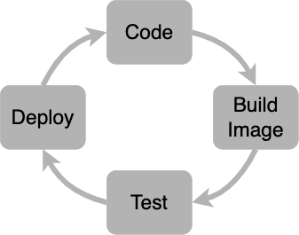

# Getting Started

Whether it's a small interaction for an single course, or a larger, more complicated application for an entire program, we develop and build *containerized apps* that can be deployed on Kubernetes.

!!! tip "Development Strategy"

    Rather than building every functional component into one large monolith, our approach is to build smaller apps that have one purpose, and then connect them together with API calls. This makes it easier to update a specific component without having to change to something that already works well.

    For example, an authentication component that interfaces with a front-end does not need to be part of the same code base as a data conversion engine that is part of the back-end.

Containerizing everything can present a challenge when developing locally unless you can also create up an environment that has all the components needed to run the app.

!!! info inline end ""

    

**[Docker](https://docs.docker.com/get-started/) to the rescue!**

Docker makes it easier to containerize apps by providing a tool stack that builds and runs standardized ***images*** - small containers of executable code that can be deployed on any platform.

Docker also helps avoid deployment trouble because of a mismatch between a local dev environment and the deployment server environment.

Building a single containerized app is pretty easy! Usually all you have to do is look for a good **base image** in the [Docker Hub](https://hub.docker.com/) and then copy your code into the container during the *build* stage. Let's take a look at how to get started.

## Requirements

Download and install [Docker desktop](https://www.docker.com/products/docker-desktop).

## Container Development Workflow

A typical container "dev loop" involves committing code, building an image, running tests, and deploying the image to a registry.



Because our goal is to develop an image, we use Docker to:

- develop locally using the `docker compose` command
- build a development image
- scan the image for vulnerabilities
- push the image to the LTC private registry

Once an image is stored in a registry it can be deployed to a Kubernetes cluster. This can be done manually through the Rancher UI, or by configuring a project to deploy automatically using a CI/CD pipeline. Before we look at CI/CD pipelines in more detail, let's go over other important details about Docker.

### Docker Details

Docker can be used in a few different ways. A nice way to try out an app is to run it using `docker` instead of installing it.

!!! example "Running nginx using Docker"

    1. Start Docker
    1. Open a terminal and run `docker container run -p 8080:80 nginx`
    1. Open a browser and navigate to `localhost:8080`

### `docker compose`

When developing a single-purpose app that runs as a component in a "microservice", `docker compose` helps by creating a local dev environment that simulates a microservice environment that runs in production.

See [Docker Compose File Basics](https://takacsmark.com/docker-compose-tutorial-beginners-by-example-basics/#compose-file-basics) for a good overview of how `docker-compose.yml` files work.

!!! example "Example postgres `stack.yml` for `docker compose`"

    ```
    # Use postgres/example user/password credentials
    version: '3.1'

    services:

      db:
        image: postgres
        restart: always
        environment:
          POSTGRES_PASSWORD: example

      adminer:
        image: adminer
        restart: always
        ports:
          - 8080:8080
    ```

### Building Images

When you are ready to turn your app into an image and push it to a registry, navigate to the GitLab project page and look for the `Packages and Registries` menu link. Click on `Container Registry` and look for the CLI commands to login to the registry, build (and tag) the image, and push it.

!!! example "Example CLI commands"

    `$ docker login registry.dev.ltc.bcit.ca`

    `$ docker build -t registry.dev.ltc.bcit.ca/web-apps/qcon/qcon-api .`

    `$ docker push registry.dev.ltc.bcit.ca/web-apps/qcon/qcon-api`

Now that you have an image in a registry, it can be deployed to a Kubernetes cluster as a workload.

### Repository Branches and "GitFlow"

!!! info ""

    This section is included here because setting up a project is one of the first things you do, even before getting started with Docker!

For us, a pattern has emerged that is loosely based on GitFlow. Projects have two persistent branches, and new bugfixes or features are added to ephemeral branches:

- a `main` branch, where code deployed to the `staging` cluster
- a `release` branch, where code gets tested, approved, and deployed to the `prod` cluster
- `feature` branches are forked from the `main` branch and merged after code review and approval

This workflow helps us keep track of bugfixes, new features, and major changes (and the work done to resolve those issues) without maintaining an overly-complex branching practice.

!!! example "Git-based Development Workflow"

    
    

    After creating or cloning a project, our workflow involves the following steps:

    1. Creating an Issue, a Merge Request (MR), and new branch
    1. Committing and syncing
        * pushing work to GitLab triggers a CI/CD pipeline that:
            1. Builds an image, tagged with the git commit hash
            1. Pushes the image to the project registry
            1. Deploys the workload to a *dev* cluster
    1. Request a code review and approval
    1. Merge into `main`
        * Merging MR's into the `main` branch triggers a CI/CD pipeline that:
            1. Builds an image, tagged with the label `latest`
            1. Pushes the image to the project registry
            1. Deploys the workload to the *staging* cluster
    1. Create a "release" MR
    1. Request a code review and approval
    1. Merge into `release`
        * Merging MR's into the `release` branch triggers a CI/CD pipeline that:
            1. Builds an image, tagged with the label `stable`
            1. Pushes the image to the project registry
            1. Deploys the workload to the *production* cluster
