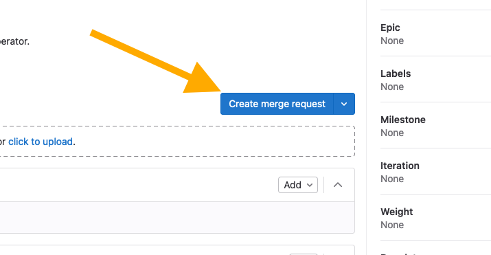

# Development workflow

Our workflow pattern is loosely based on [GitLab Flow](https://docs.gitlab.com/ee/topics/gitlab_flow.html). Projects have a persistent **`main`** branch, and new bugfixes or features are added to ephemeral **`feature`** or **`fix`** branches.

`feature` and `fix` branch code is deployed to a `review` cluster and `main` branch code (the default) is deployed to the `latest` and `stable` clusters.

This workflow helps us keep track of bugfixes, new features, and major changes without complex branching.

!!! example "Development workflow"

    
    

    After cloning a project repository:

    1. **Create an Issue, a Merge Request (MR), and new branch for development**

        1. Create an Issue (for example: `updates README with project description`)
        2. Create a Merge Request (MR) and a new branch

            

    2. **Checkout the new branch, develop, commit, and push**
        
        Pushing your code triggers a pipeline run. The pipeline:
        
        1. Builds an image
        2. Pushes the image to the project registry
        3. Deploys the workload to a cluster for **`review`**

    3. When you are satisfied with your work, **request a code review and approval**
    4. **Merge your work into the `main` branch**
    
        Merging a development branch into **`main`** triggers a pipeline run that:

        1. Builds an image tagged with the label `latest`
        2. Pushes the image to the project registry
        3. Deploys the workload to the `latest` cluster

    Commits that have a commit message that starts with a semantic versioning keyword will automatically increment the git version tag and trigger a deployment to the *stable* cluster.
