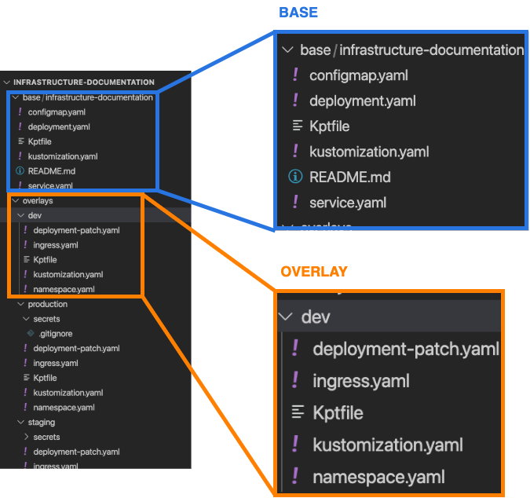

# Deployment Packages

The default pipeline file can help you get started with an automated build and deploy, but it's not configured to do much out of the box - it requires configuration before you can see your app on a cluster.

Up until now, we've talked about the `Dockerfile` and the `CI/CD pipeline configuration file` (`.gitlab-ci.yml`). But the other part of the picture is the set of Kubernetes Resource Manifest files (KRM's) you configure to tell the cluster how to deploy your app. Together, these files are called a **deployment package**.

## Pipelines and Deployment Packages

Your source code project runs the pipeline that builds and deploys your app. The diagram below outlines how the pipeline gets triggered and how the deployment package gets deployed to a `dev` cluster.


## Kustomize Concepts

A deployment package is built around [`kustomize`](https://kubectl.docs.kubernetes.io/), where a base set of configuration files are modified by *overlays* based on the cluster they're being applied to.

Here's what the structure of a kustomize-based *deployment package* looks like:

<!-- markdownlint-disable MD033 -->
<figure markdown>
{ width="500" }
  <figcaption>An example nginx deployment package</figcaption>
</figure>

### The Base

The base in the example above consists of some standard KRM's:

* `configmap.yaml`

    Because this package is based on `nginx`, it also includes a `configmap.yaml` that contains `nginx.conf` settings.

* `deployment.yaml`
* `Kptfile`

    A `kpt` package identifier. It contains *inventory* details about all the resources that are applied to the cluster together.

* `kustomization.yaml`

    A kustomize specification file. It describes the resources that should be applied to the cluster.

* `README.md`

    Information about the package

* `service.yaml`

### The Overlay

The files in the overlay are *patches* that describe how a resource is changed when it is applied to a cluster.

In the example above, the `dev` cluster overlay adds a `deployment-patch.yaml`, an `ingress.yaml`, and a `namespace.yaml` to change the way the package is deployed. In a fully-configured deployment package, there are similar files in the `staging` and `production` overlays which make adjustments to the workloads applied to the `staging` and `production` clusters, respectively.

## LTC `generic-dev` deployment package

When the [Default LTC GitLab CI/CD Pipeline](https://issues.ltc.bcit.ca/-/snippets/60) is first used in your project, it deploys a `generic-dev` package that demonstrates how the deployment package works. If you create an issue, a merge request, and a branch, the pipeline deploys the `generic-dev` deployment package to your `dev` cluster. To view it, click on the `View App` button in the merge request.

!!! tip "Create a Deployment Package for your project"

    To have the [Default LTC GitLab CI/CD Pipeline](https://issues.ltc.bcit.ca/-/snippets/60) automatically create a deployment package that you can start working with, look for the following flag at the bottom of the `.gitlab-ci.yml` file:
    
        # DEPLOY_PKG_INIT='true'
    
    Uncomment it. Commit and push this change to trigger the creation of a simple deployment package for your project.

    The process takes about 5 minutes and the new deployment package will be located in the [Deployments](https://issues.ltc.bcit.ca/deployments) group.

    The deployment package is a replica of the `generic-dev` deployment package. In GitLab, navigate to the [Deployments](https://issues.ltc.bcit.ca/deployments) group and clone your project's deployment package to get started.

## First steps *kustomizing* the Deployment Package

The `generic-dev` deployment package contains example bases that might help give you an idea about how different workloads can be structured. The package also has example `dev`, `staging`, and `production` overlays that can be used as starting points for the kustomization.

=== "nginx-unprivileged"

    * deployment.yaml
    * service.yaml

=== "mysql"

    * deployment.yaml
    * pvc.yaml
    * service.yaml

=== "nodejs-mongodb"

    * **mongo-express**
        * deployment.yaml

    * service.yaml

=== "wordpress"

    * **deployment**
        * volume.yaml
        * wordpress-deployment.yaml

    * **mysql**
        * mysql-deployment.yaml

    * service.yaml

=== "`dev` overlay"

    * ingress.yaml
    * namespace.yaml

**In the `deployment package` project**

One of the easiest ways to update your app's deployment package is to do a "search and replace" on the dev overlay.

1. Replace all instances of `generic-dev` in the `overlays/dev` path

    Eg. run `sed` replacing `yourAppName` with the name of your project (lowercase, no spaces) on all the files in the `dev` path:

        sed -i -- 's/generic-dev/yourAppName/g' overlays/dev/*

1. Commit the changes to the deployment package repo

**In the `source code` project**

1. Create an issue
1. Create a merge request (MR) and a branch
1. Checkout the branch on your local code editor
1. Make a small change to the source code (such as commenting out the DEPLOY_PKG_INIT flag set earlier), and commit the change.
1. Push the commit to the remote and watch the pipeline on the `CI/CD > Pipelines` page

The pipeline will look for an image in your project's registry and deploy it with sane defaults.

You may need to make changes to your deployment package to run the pipeline successfully, but thankfully this effort is only required once. When your deployment package is configured correctly, it's effectively "set and forget"!

## `staging` and `production` Deployment Package Overlays

After you have a working `dev` overlay, most of the "heavy lifting" is done. Make two copies of the `dev` overlay and rename the folders to `staging` and `production`, respectively.

The biggest differences between `staging`/`production` overlays and the `dev` overlay has to do with routing and security. If your application uses any kind of secret, you should be storing and retrieving these from Vault.

!!! tip "Retrieving secrets from Vault"

    Use the following annotations in your `staging`/`production` overlay `deployment.yaml` file to configure automatic secret retrieval:

    ```
        spec:
        ...
          template:
            metadata:
              annotations:
                vault.hashicorp.com/agent-inject: 'true'
                vault.hashicorp.com/role: '{projectName}-production-kubeauthbot'
                vault.hashicorp.com/agent-inject-secret-config: 'web-apps/data/{projectName}'
                vault.hashicorp.com/agent-inject-template-config: |
                  {{ with secret "web-apps/data/{projectName}" -}}
                  {secretKey}="{{ .Data.data.{secretKey} }}"
                  {{- end }}
    ```

In terms of routing, most of it is taken care-of automatically, but if you need a unique URL, you may need to setup an additional **public-endpoint** (ingress) rule.
